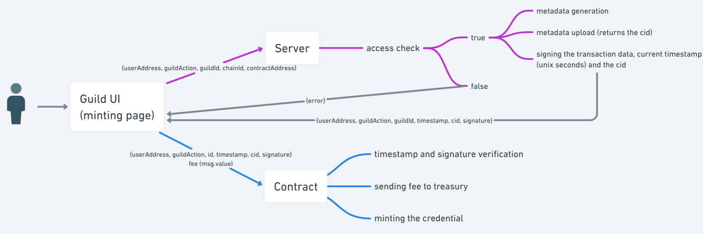

# Guild Pin redesign

We arrived to a stage where we should rethink how distributing pins is done. This documents the already considered solutions as well as proposes a new one.

## Requirements

- users should be able to mint pins based on activity on Guild
- users should pay a fee
- users should not be able to alter metadata
  - the metadata should be uploaded by us, in a controlled environment

## Solutions

### Verify on a centralized server (proposed)

The server-side code is a part of Guild's [core](https://github.com/agoraxyz/guild-backend). Later, we may consider moving it to a separate service, but it does not seem necessary at the time of writing.

#### Flow

- the user selects the pin they want to mint on the Guild UI (only the ones the user has access to are displayed)
- the UI makes a call to the server
  - parameters: userAddress, [guildAction](contracts/interfaces/IGuildPin.md#guildaction), id (guildId/roleId based on the check), chainId, contractAddress
- the server:
  - checks the access (needs direct db access or an api call to the core in case of becoming a separate service)
  - generates the image and uploads/pins it on IPFS
  - signs the input parameters, the cid and the current timestamp (unix seconds) using a private key
  - returns the signed data alongside the signature
- the user initiates a transaction to the contract. Supplies the data obtained from the server and the fee
- the contract:
  - checks the timestamp (reverts if it's older than 1 hour)
  - verifies the signature (reverts if it's invalid)
  - updates the claimedTokens mapping
  - sends the fee to the treasury
  - mints the pin

### Verify using an oracle (discontinued)

The idea was to use a [Chainlink](https://chain.link/) oracle to check access dynamically. Uploading the metadata would have happened either on the client side or via a serverless function. However, after trying various implementations, we discarded the idea as it was resource-heavy and unnecessarily complicated.

#### The flow without caring for metadata

- the user selects the pin they want to mint on the Guild UI (only the ones the user has access to are displayed)
- the user initiates a transaction to the contract
- the contract requests the oracle whether the user has access
- the oracle calls one of our endpoints ([user/membership/{address}](https://api.guild.xyz/v1/user/membership/{address}?format=oracle) or [guild/access/{guildId}/{address}](https://api.guild.xyz/v1/guild/access/{guildId}/{address}?format=oracle))
- the oracle sends a transaction to the contract with the result
- the contract either mints the pin or reverts, based on the result

#### The metadata problem and it's solutions

- if it's uploaded prior to the contract deploy, it's not dynamic
- if it's uploaded right before the transaction, we should ensure the tokenURI function still works. This can be done in two ways:
  - update it in the contract:
    - if it's done by the user, we can't guarantee it's validity
    - if it's done by a service ran by us, that's uneconomical, more complicated, less elegant, more error-prone
  - store only a pointer in the contract and update that off-chain: [IPNS](https://docs.ipfs.tech/concepts/ipns/), [DNSLink](https://docs.ipfs.tech/concepts/dnslink/). These solutions are probably more error-prone and not exactly meant for this purpose. Furthermore, they tend to expire, so we would have to renew them periodically. Additionally, decentralization is compromised - the metadata might become unavailable due to human errors.
- or it could be uploaded right "during" the minting process. In this case, the oracle would not call directly the aforementioned endpoints, but a new one, that could:
  - check the access
  - generate/upload metadata
  - return the new cid to the contract

The last one does look like a valid solution - probably the best one if we chose oracles.
